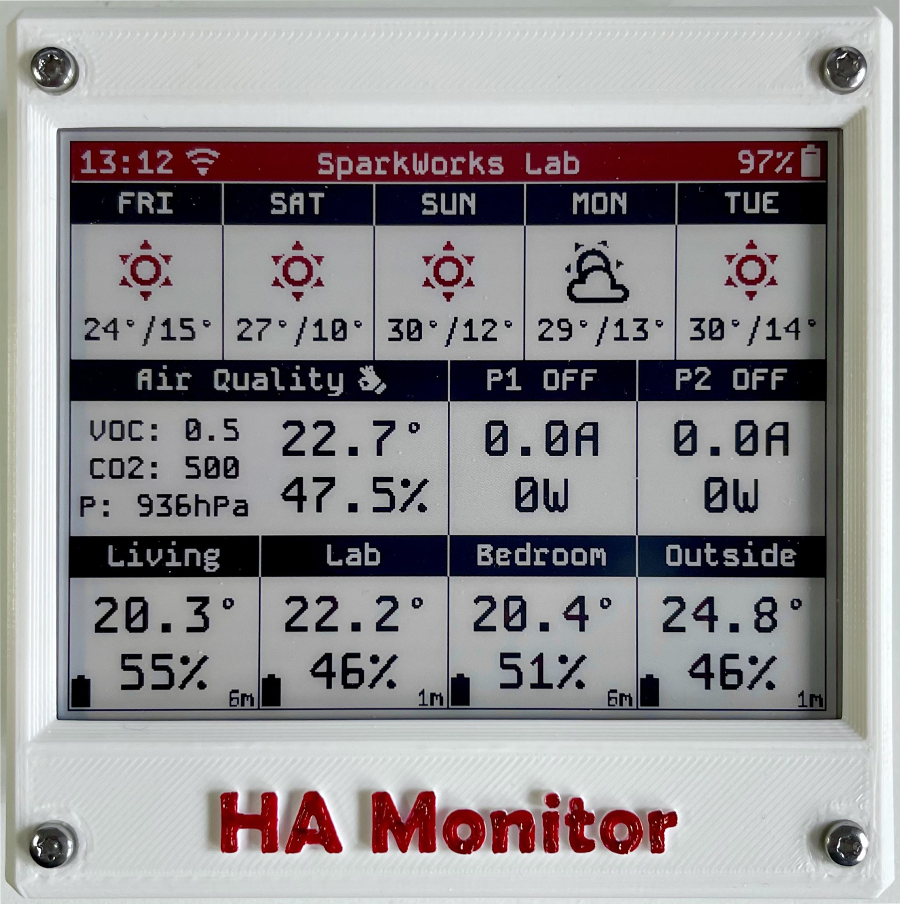
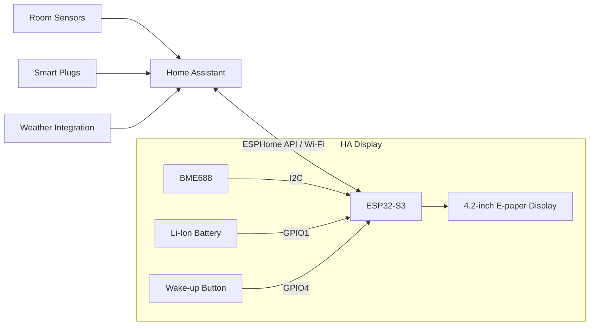
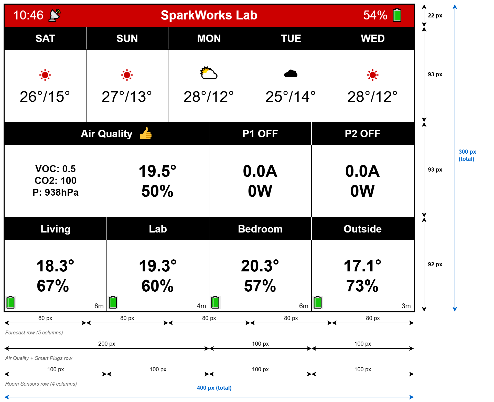
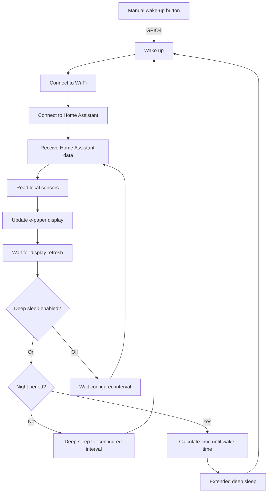
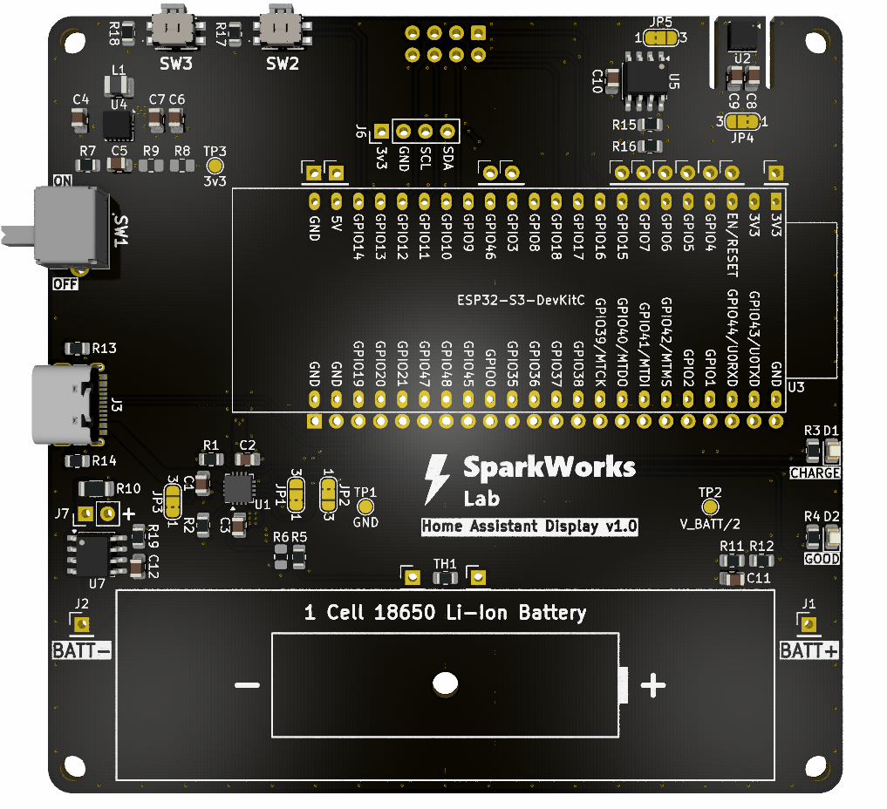

<div align="center">

# Home Assistant Display

[](https://esphome.io/)
[](https://www.espressif.com/)
[](https://www.home-assistant.io/)
[](LICENSE)




**A low-power ESPHome e-paper dashboard for Home Assistant.**

A battery-powered Home Assistant display built around an ESP32-S3 and a 4.2" three-color e-paper display.

The device periodically wakes up, connects to Home Assistant, retrieves sensor data, updates the display, and then returns to deep sleep to minimize power consumption.

</div>

---

## Contents

- [Overview](#overview)
- [Features](#features)
- [System Architecture](#system-architecture)
- [Project Structure](#project-structure)
- [Display](#display)
- [Power Management](#power-management)
- [Home Assistant Integration](#home-assistant-integration)
- [Hardware](#hardware)
- [Firmware](#firmware)
- [Enclosure](#enclosure)
- [Installation](#installation)
- [Future Improvements](#future-improvements)
- [Design Principles](#design-principles)
- [References](#references)
- [License](#license)

---

## Overview

The **Home Assistant Display** is a battery-powered e-paper dashboard
designed to provide a quick overview of home information without requiring
a permanently powered screen.

The display combines data from Home Assistant with measurements from local
sensors and presents the information through a modular set of e-paper
widgets.

The low-power architecture allows the device to remain in deep sleep for
most of the time, waking periodically to update the display.

The project is designed to be modular and expandable, with separate
documentation for the firmware, hardware, and enclosure.

---

## Features

* 4.2" three-color e-paper display.
* Home Assistant integration through the ESPHome API.
* Weather forecast display.
* Local temperature, humidity, and atmospheric pressure monitoring.
* BME688 gas resistance and air quality monitoring.
* Smart Plug status monitoring.
* Current and power consumption display.
* Room temperature and humidity monitoring.
* Sensor availability detection.
* Low-power operation using deep sleep.
  * Automatic configurable interval refresh cycle during the day.
  * Extended deep sleep during the night.
* Manual wake-up button.  
* Li-Ion battery voltage monitoring.
* Wi-Fi connection status indication.
* Home Assistant API connection status indication.
* Configurable RGB debug LED.
* Modular display and widget architecture.
* Doxygen documentation.
* *Fail-Safe Operation:* Network mitigation routines preventing infinite loops and battery drain during Wi-Fi or HA outages.

---

## System Architecture



The display acts as a low-power endpoint for Home Assistant.

Home Assistant provides aggregated data and configuration, while the ESP32
is responsible for local sensor measurements, display rendering,
connectivity, and power management.


---

## Project Structure

```text
.
├── enclosure/       # 3D-printable enclosure and mechanical documentation
├── firmware/        # ESPHome configuration and C++ firmware
├── hardware/        # Schematics, PCB layouts, and BOMs
├── images/          # Project images and documentation assets
├── README.md        # Main project documentation
└── LICENSE          # AGPL-3.0 License
```

Each major part of the project has its own documentation:

* [Firmware](firmware/) — ESPHome configuration, C++ code,
sensors, display widgets, power management, and Home Assistant
integration.
* [Hardware](hardware/) — electronics, schematics, PCB
revisions, and BOM.
* [Enclosure](enclosure/) — 3D-printable enclosure files,
assembly information, and mechanical details.

---

## Display

The display is divided into several independent widgets.

* **Header**

  * Last update time.
  * Wi-Fi and Home Assistant connection status.
  * Title.
  * Battery status.

* **Top Section**

  * Weather forecast.

* **Middle Section**

  * BME688 environmental and air quality data.
  * Smart Plug monitoring.

* **Bottom Section**

  * Room temperature and humidity sensors.

The display drawing code is organized into reusable functions. This makes it easy to modify the layout or add new widgets without turning the main ESPHome display lambda into a large block of code.

### Display Layout

The 400 × 300 px screen is divided into four sections, each mapped to positions and sizes defined in `layout.h`.

<div align="center">

</div>

---

## Power Management

Low power consumption is one of the main goals of the project.

The device does not remain continuously connected to Wi-Fi. Instead, the ESP32 follows this cycle:




During the day, the display wakes up and refreshes at the interval configured through Home Assistant.

During the night, it enters a longer deep sleep period and automatically wakes up at the configured morning wake time.

The sleep schedule and daytime sleep duration can be configured directly
from Home Assistant without recompiling or reflashing the firmware.

A physical wake-up button can also be used to wake the device manually.

For detailed implementation information, see
[Power Management](firmware/README.md#power-management) in the firmware
documentation.

---

## Home Assistant Integration

The display communicates with Home Assistant through the ESPHome API.

Home Assistant provides:

* Room sensor data.
* Smart Plug information.
* Weather forecast data.
* Sleep schedule configuration.
* Daytime sleep duration.
* Deep-sleep enable/disable state.

Several Home Assistant helpers are used as persistent configuration
parameters for the display.

The current configuration includes:

* Sleep start hour.
* Wake-up hour.
* Daytime sleep duration.
* Deep-sleep enable/disable.

Because these values are stored by Home Assistant, they remain available while the ESP32 is in deep sleep.

When the display wakes and reconnects to Home Assistant, it retrieves the current configuration and uses it to determine its next operating cycle.

Changes made in Home Assistant therefore take effect on the next wake-up cycle.

The physical wake-up button can be used to apply configuration changes immediately instead of waiting for the next scheduled wake-up.

Detailed Home Assistant configuration is documented in the
[firmware](firmware/README.md#home-assistant-integration) documentation.

---

## Hardware

The HA Display has been developed through two hardware versions:

### Prototype

The prototype is built using an **ESP32-S3-DevKitC-1 development board** and a
2.54mm pitch protoboard. It was used to develop and validate the hardware and
software before designing the dedicated PCB.

Main hardware components:

* ESP32-S3-DevKitC-1 development board.
* WeAct Studio 4.2" (400 × 300 px) three-color e-paper display.
* Bosch BME688 environmental and air quality sensor.
* Li-Ion 18650 battery.
* 1S BMS/protection module.
* TPS63802 buck-boost 3,3v converter module.
* TP4056 USB-C Li-Ion charger module.
* 1 x push button for manual wake-up.

[View prototype hardware documentation](hardware/prototype/README.md)

### v1.0 Dedicated PCB

<div align="center">

</div>

The v1.0 hardware replaces the prototype wiring with a **dedicated 4-layer PCB** designed specifically for the HA Display with controlled USB differential pair impedances and optimized power and ground planes.
* ESP32-S3-DevKitC-1 development board.
* WeAct Studio 4.2" (400 × 300 px) three-color e-paper display.
* Bosch BME680/BME688 environmental sensor.
* Li-Ion 18650 battery.
* BQ24072: Li-Ion battery charger and power-path management IC (prioritizes USB input, bypassing cell micro-cycling).
* TPS63001: High-efficiency buck-boost converter ensuring a stable 3.3V rail down to battery cutoff.
* XB8089D: Integrated SOP8 advanced battery protection sub-circuit.
* Redundant DPDT Switch: Dual parallel-trace slide switch ensuring high mechanical robustness and reduced contact resistance.
* EEPROM: Onboard I2C storage for non-volatile data storage.
* 2 x push buttons for navigation and manual wake-up.
* Test points for debugging and measurements.
* Expansion headers for additional peripherals.
* Jumper at GND to measure current consumption easily.

[View v1.0 hardware documentation](hardware/v1.0/README.md)

### Home Assistant Server

Both versions communicate with a **Home Assistant server running on a
Raspberry Pi 3 B+** through ESPHome.

---

## Firmware

The firmware is based on ESPHome with an additional modular C++ layer for display widgets, battery estimation, power management, layout, and other reusable functionality.

The firmware configuration is divided into small YAML packages, while application-specific functionality is implemented through C++ header files.

This separation makes the firmware easier to maintain and allows hardware configuration, Home Assistant entities, display layout, and application logic to evolve independently.

Go to [firmware](firmware/README.md) documentation.

---

## Enclosure

The project includes a dedicated 3D-printed enclosure designed around the
display and electronics.

The enclosure documentation contains:

* STL files.
* Assembly information.
* Mechanical details.
* Printing recommendations.

Go to [enclosure](enclosure/README.md) documentation.

---

## Installation

The complete installation procedure is documented in the
[firmware](firmware/README.md#installation) documentation.

The general process is:

1. Install Python and ESPHome.
2. Clone this repository.
3. Configure the Home Assistant entities.
4. Configure Wi-Fi credentials.
5. Install the required Home Assistant package.
6. Configure the Home Assistant helpers.
7. Compile the ESPHome firmware.
8. Upload the firmware to the ESP32.

---

## Future Improvements

Some ideas for future development include:

* Particulate matter monitoring.
* Dedicated CO₂ measurement.
* Additional air quality sensors.
* Improved BME688 gas analysis and classification.
* ADC calibration based on measured voltage.
* Battery discharge testing and a custom State of Charge curve.
* Improved State of Charge estimation.
* Dynamic e-paper refresh timing.
* Historical sensor trends.
* Additional Home Assistant entities.
* Configurable display layouts.

---

## Design Principles

The goal of this project is to create a simple, low-power, and fully customizable Home Assistant information display.

The project focuses on:

* Low power consumption.
* Modular code.
* Reusable display widgets.
* Easy integration with Home Assistant.
* Battery operation.
* Simple and accessible hardware.
* Easy future expansion.

The architecture intentionally separates Home Assistant data aggregation from the ESP32 application logic.

Home Assistant provides the information and configuration, while the ESP32 focuses on local sensing, display rendering, connectivity, and power management.

---

## References

* [Home Ambient (Faulty Project).](https://faultyproject.es/category/proyectos/home-ambient/)
* [ESPHome E-ink Weather board.](https://github.com/xangin/eink-weather-board)
* [Material Design Icons Library.](https://pictogrammers.com/library/mdi/)

---

## License

The source code in this repository is licensed under the GNU Affero General Public License v3.0 (AGPL-3.0).

See the [LICENSE](LICENSE) file for the full license text.

Third-party assets included in this repository may be distributed under their respective licenses.

### Third-Party Assets

This project includes the Material Design Icons webfont by Pictogrammers.

The font is distributed under the Apache License 2.0.

See the [Pictogrammers](https://pictogrammers.com/) website and the [Apache License 2.0](https://www.apache.org/licenses/LICENSE-2.0) for more information.

### Images and Photographs

Unless otherwise stated, photographs and images in this repository are copyright © 2026 SparkWorksLab.

They are provided for documentation and demonstration purposes only and are not covered by the AGPL-3.0 License.

Permission is required for their reuse, redistribution, or commercial use.

---
