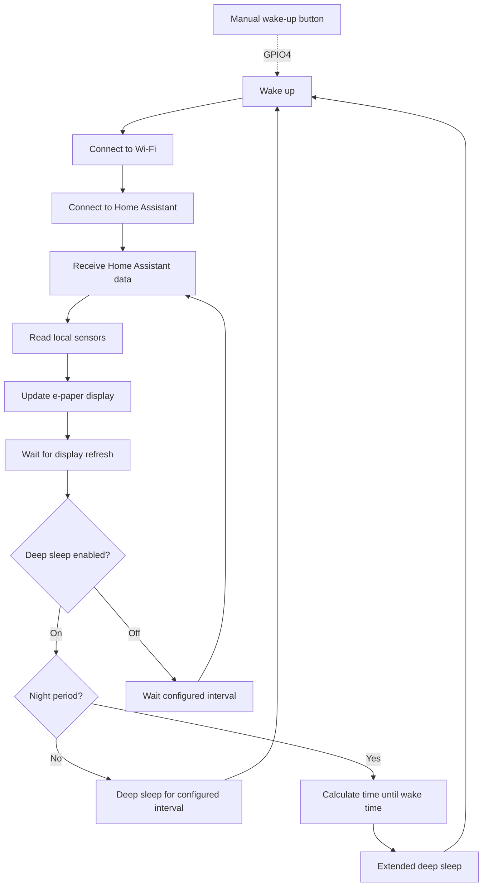
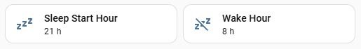
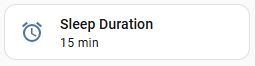
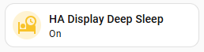

<div align="center">

# HA Display: Firmware

ESPHome firmware, configuration, and C++ application logic
for the Home Assistant Display

</div>

---

## Contents

- [Overview](#overview)
- [Project Structure](#project-structure)
- [Firmware Architecture](#firmware-architecture)
- [ESPHome Configuration](#esphome-configuration)
- [C++ Application Layer](#c-application-layer)
- [Display System](#display-system)
- [Home Assistant Integration](#home-assistant-integration)
- [Monitoring and Sensors](#monitoring-and-sensors)
- [Power Management](#power-management)
- [Deep Sleep Configuration](#deep-sleep-configuration)
- [Manual Wake-Up](#manual-wake-up)
- [Connectivity and Fail-Safe Operation](#connectivity-and-fail-safe-operation)
- [Debug RGB LED](#debug-rgb-led)
- [BSEC2 Experimental Configuration](#bsec2-experimental-configuration)
- [Installation](#installation)
- [Configuration](#configuration)
- [Troubleshooting](#troubleshooting)
- [Doxygen Documentation](#doxygen-documentation)

---

## Overview

The firmware is based on **ESPHome** and uses a modular C++ application layer for functionality that is more convenient to implement outside the ESPHome YAML configuration.

ESPHome provides:

* Hardware configuration.
* Wi-Fi connectivity.
* Home Assistant API communication.
* Sensor integration.
* Deep-sleep control.
* GPIO handling.
* OTA and serial firmware updates.

The C++ layer provides:

* Display rendering.
* Reusable display widgets.
* Display layout definitions.
* Battery State of Charge estimation.
* Power-management calculations.
* Weather icon conversion.
* RGB debug LED helpers.

The firmware is intentionally divided into small reusable components so that individual parts can be modified without turning the main ESPHome configuration into a large monolithic file.

---

## Project Structure

The project is divided into small, reusable YAML configuration files and C++ header files.

```text
.
├── fonts/
│   └── materialdesigniconswebfont.ttf
│
├── include/
│   ├── battery.h
│   ├── display.h
│   ├── display_bsec.h
│   ├── layout.h
│   ├── led.h
│   ├── power.h
│   └── weather_icons.h
│
├── packages/
│   ├── display.yaml
│   ├── entities.yaml
│   ├── fonts.yaml
│   ├── forecast.yaml
│   ├── sensors.yaml
│   ├── sensors_bsec.yaml
│   └── wifi.yaml
│
├── .gitignore
├── HA-Display.yaml
├── ha_display_sensor.yaml
├── README.md
└── secrets.example.yaml
```
---

## Firmware Architecture

The main ESPHome configuration includes the individual YAML packages and the C++ header files.

The standard firmware uses `sensors.yaml` and `display.h`.

An alternative BSEC2 configuration is provided in `sensors_bsec.yaml` and `display_bsec.h` for experimental or continuously powered applications.

Only one sensor/display profile is intended to be active at a time.

The default profile uses `sensors.yaml` and `display.h`, while the optional BSEC2 profile uses `sensors_bsec.yaml` and `display_bsec.h`.

---

## ESPHome Configuration

The firmware configuration is split into several ESPHome packages, each responsible for a specific subsystem.

### `HA-Display.yaml`

This is the main ESPHome configuration file.

It defines the ESP32-S3 hardware, includes the project packages, references the external C++ headers, and provides the top-level configuration required to build the firmware.

The main configuration should remain relatively small because most functionality is delegated to the individual packages and C++ modules.


### `display.yaml`

Configures the e-paper display and the main display update lambda.

The display layout is implemented through reusable drawing functions defined in the project header files.

### `entities.yaml`

Defines the Home Assistant entities imported into ESPHome, including room sensors, Smart Plug data, battery information, and configurable sleep schedule parameters.

### `fonts.yaml`

Defines the fonts and Material Design icon glyphs used by the e-paper display.

### `forecast.yaml`

Defines the Home Assistant entities used to retrieve weather forecast data and makes the forecast attributes available to the display.

### `sensors.yaml`

Same configuration as `sensors.yaml` adding BSEC2 algorithm for the BME68x sensor.

### `sensors_bsec.yaml`

Configures locally connected sensors and Home Assistant entities used by the display.

Includes environmental measurements, battery monitoring, and configurable  sleep schedule entities.

### `wifi.yaml`

Configures the Wi-Fi connection and ESPHome API used to communicate with Home Assistant.

### `secrets.example.yaml`

Copy this file to `secrets.yaml` and update it with your own Wi-Fi credentials:

```yaml
wifi_ssid: "YOUR_WIFI_SSID"
wifi_password: "YOUR_WIFI_PASSWORD"
```

The `secrets.yaml` file should not be committed to the repository.


---

## C++ Application Layer

Application-specific functionality is implemented through C++ header files.

### `battery.h`

Contains battery-related helper functions.

The battery State of Charge is estimated using a voltage lookup table instead of a simple linear calculation.

This provides a more realistic approximation of the charge level of a Li-Ion cell.

### `display.h`

Provides reusable functions for drawing the different widgets displayed on the e-paper dashboard.

 The widgets include the header, weather forecast, environmental sensor, Smart Plug display, room sensors, and battery indicators. For example:

* `drawHeader()`.
* `drawBatteryIcon()`.
* `drawForecast()`.
* `drawAirSensor()`.
* `drawSmartPlugs()`.
* `drawRoomSensors()`.

### `display_bsec.h`

Same as `display.h` replacing `drawAirSensor()` to show BSEC2 calculated data.

### `layout.h`

Contains display layout definitions such as:

* Screen dimensions.
* Widget positions.
* Margins.
* Alignment constants.
* Widget spacing.

Keeping the layout separate from the drawing functions makes it easier to reorganize the display without modifying the widget implementation.

### `led.h`

Contains helper functions for the RGB status LED.

The LED can be enabled for debugging purposes using a compile-time definition:

```cpp
#define DEBUG_LED
```

When debugging is disabled, the LED control code is excluded from the build.

### `power.h`

Contains power management helper functions.

The current implementation calculates the deep sleep duration dynamically based on the current time and configurable sleep start and wake times.

This allows the display to:

* Refresh every 15 minutes during the day.
* Enter a single extended deep sleep period during the night.
* Wake up automatically at the configured morning wake time.

### `weather_icons.h`

Provides helper functions and definitions for converting Home Assistant weather condition strings into the corresponding Material Design icons used by the e-paper display.

### `.gitignore`

The repository includes a `.gitignore` file to prevent personal configuration files, such as `secrets.yaml`, from being committed.

---

## Home Assistant Integration

The display communicates with Home Assistant through the ESPHome API.

Several Home Assistant entities are imported directly into ESPHome, including room temperature and humidity sensors, smart plug states and power consumption data, weather forecast information, and the sleep schedule configuration.

### Home Assistant Helpers

The sleep schedule is configured using three Home Assistant `input_number` helpers:

* `input_number.sleep_start_hour`
* `input_number.wake_hour`
* `input_number.sleep_duration`

Create these helpers from:

**Settings → Devices & services → Helpers → Create Helper → Number**

Configure them with:

<div align="center">

| Helper | Minimum | Maximum | Step |
| --- | --- | --- | --- |
| `input_number.sleep_start_hour` | 0 | 23 | 1 |
| `input_number.wake_hour` | 0 | 23 | 1 |
| `input_number.sleep_duration` | 5 | 60 | 5 |

</div>

These helpers act as the persistent configuration for the display. ESPHome reads their values after connecting to Home Assistant following a wake-up. See [Deep Sleep Configuration](#deep-sleep-configuration) for how they are used.

An additional helper controls whether the display uses deep sleep at all:

* `input_boolean.ha_display_deep_sleep`

Create it from:

**Settings → Devices & services → Helpers → Create Helper → Toggle**

No further configuration is needed — the display reads its state directly. See [Deep Sleep Configuration](#deep-sleep-configuration) for how it's used.

### Home Assistant Package

Some of the data displayed by the display is prepared by Home Assistant.

Before installing the ESPHome configuration, copy:

```text
ha_display_sensor.yaml
```

to the Home Assistant packages directory:

```text
/config/packages/
```

Make sure that the packages directory is included in your Home Assistant configuration.

For example:

```yaml
homeassistant:
  packages: !include_dir_named packages
```

Then restart Home Assistant.

The package creates the template entities required by the display, including weather forecast data and sensor availability states.

### Weather Forecast

Home Assistant is responsible for retrieving and preparing the weather forecast.

A template sensor stores the forecast data as attributes. The ESPHome device retrieves these attributes and displays them on the e-paper screen.

The forecast includes:

* Day.
* Weather condition.
* Maximum temperature.
* Minimum temperature.

The forecast data can be refreshed periodically to prevent outdated information from being displayed.

This is configured in the `ha_display_sensor.yaml` file.

```yaml
- trigger:
    - platform: homeassistant
      event: start

    - platform: time_pattern
      hours: "/1"
      minutes: 1

  action:
    - service: homeassistant.update_entity
      target:
        entity_id: weather.forecast_home

    - delay: "00:00:02"
    
    - service: weather.get_forecasts
      target:
        entity_id: weather.forecast_home
      data:
        type: daily
      response_variable: daily

  sensor:
    - name: "eink_sensors"
      unique_id: eink_sensors

      state: >
        {{ daily['weather.forecast_home'].forecast[0].condition }}

      attributes:

        forecast_day_1: >
          {{ as_timestamp(daily['weather.forecast_home'].forecast[0].datetime)
             | timestamp_custom('%a')
             | upper }}

        forecast_condition_1: >
          {{ daily['weather.forecast_home'].forecast[0].condition }}

        forecast_temp_max_1: >
          {{ daily['weather.forecast_home'].forecast[0].temperature | round }}

        forecast_temp_min_1: >
          {{ daily['weather.forecast_home'].forecast[0].templow | round }}
```

---

## Monitoring and Sensors

The display combines data received from Home Assistant with locally connected sensors.

### Room Temperature and Humidity Sensors

The display retrieves temperature and humidity data from Home Assistant entities. This allows the device to display environmental data collected by external sensors distributed throughout the home.

The sensor entities can be easily adapted in `entities.yaml` to match the Home Assistant configuration.

```yaml
sensor:
  - platform: homeassistant
    id: t1_temperature
    entity_id: sensor.t1_temperature

  - platform: homeassistant
    id: t1_humidity
    entity_id: sensor.t1_humidity

  - platform: homeassistant
    id: t1_battery
    entity_id: sensor.t1_battery 

  - platform: homeassistant
    id: t1_age
    entity_id: sensor.t1_sensor_age    
```

Sensor availability is also monitored to detect stale or unavailable devices. When a sensor has not reported data for an extended period, its status can be visually indicated on the display instead of presenting outdated measurements as current values.

A binary sensor is created in `entities.yaml` to handle this functionality.

```yaml
binary_sensor:
  - platform: homeassistant
    entity_id: binary_sensor.t1_sensor_state
    id: t1_online
```    

Stale or unavailable sensors can therefore be visually highlighted instead of displaying outdated values as if they were current. This is configured in the `ha_display_sensor.yaml` file. 

```yaml
- trigger:
    - platform: time_pattern
      minutes: "/1"

  binary_sensor:
    - name: T1 Sensor State
      unique_id: t1_online
      state: >
        {{ (now() - states.sensor.t1_temperature.last_updated).total_seconds() < 900 }}
```

Each Room Sensor widget displays:

* Sensor name.
* Temperature.
* Humidity.
* Battery Level.
* Minutes since last update.
* Status (Red color if not updated for more than 15 minutes).

The widget implementation is reusable:

```cpp
drawRoomSensor(
    it,
    x,
    y,
    name,
    temperature,
    humidity,
    battery,
    status,
    age);
```

A higher-level function handles the collection of Room Sensors widgets:

```cpp
drawRoomSensors(it);
```

### Smart Plug Monitoring

The display currently displays the status of two Home Assistant Smart Plugs.

The sensor entities can be easily adapted in `entities.yaml` to match the Home Assistant configuration.

```yaml
sensor:
  - platform: homeassistant
    id: p1_voltage
    entity_id: sensor.p1_voltage
  - platform: homeassistant
    id: p1_current
    entity_id: sensor.p1_current  
  - platform: homeassistant
    id: p1_power
    entity_id: sensor.p1_power

switch:
  - platform: homeassistant
    entity_id: switch.p1
    id: p1_state    
```

Each Smart Plug widget displays:

* Plug name.
* ON/OFF state.
* Current consumption.
* Power consumption.

The widget implementation is reusable:

```cpp
drawSmartPlug(
    it,
    x,
    y,
    name,
    state,
    current,
    power);
```

A higher-level function handles the collection of Smart Plug widgets:

```cpp
drawSmartPlugs(it);
```

Additional Smart Plugs can therefore be added without modifying the individual widget implementation.

### Environmental Sensor

A Bosch BME680/BME688 environmental sensor is connected directly to the ESP32 through the I2C bus.

The standard firmware uses the conventional BME68x sensor driver rather than BSEC2. This configuration provides the basic environmental measurements while remaining fully compatible with the low-power deep-sleep architecture.

The sensor is connected through I2C using address `0x77`. The address depends on the CS pin configuration of the sensor module: with CS pulled high, the sensor uses `0x77`; with CS pulled low, it uses `0x76`.

The standard configuration provides measurements such as:

* Temperature.
* Relative humidity.
* Atmospheric pressure.
* Gas resistance.
* IAQ.

The sensor values are available both:

* On the e-paper display.
* As entities in Home Assistant.

The project also includes an optional BSEC2-based configuration. See [BSEC2 Experimental Configuration](#bsec2-experimental-configuration) for details.

The environmental values are provided directly by the BME688, while the air-quality indicators are calculated by BSEC2 from the sensor measurements.

The temperature, humidity and pressure values use small change filters to avoid unnecessary updates when the measured value changes only slightly.

The IAQ value is classified into seven levels according to the BSEC IAQ scale and represented directly on the e-paper display using the corresponding Material Design Icon:

<div align="center">

<table>
<tr>
<td align="center">
<br>
<code>mdi-hand-okay</code><br>
<sub>Excellent · IAQ 0–50</sub>
</td>

<td align="center">
<br>
<code>mdi-thumb-up</code><br>
<sub>Good · IAQ 51–100</sub>
</td>

<td align="center">
<br>
<code>mdi-thumb-up-outline</code><br>
<sub>Lightly polluted · IAQ 101–150</sub>
</td>

<td align="center">
<br>
<code>mdi-air-thumb-down-outline</code><br>
<sub>Moderately polluted · IAQ 151–200</sub>
</td>

<td align="center">
<br>
<code>mdi-thumb-down</code><br>
<sub>Heavily polluted · IAQ 201–250</sub>
</td>

<td align="center">
<br>
<code>mdi-face-mask</code><br>
<sub>Severely polluted · IAQ 251–350</sub>
</td>

<td align="center">
<br>
<code>mdi-skull-crossbones</code><br>
<sub>Extremely polluted · IAQ 351+</sub>
</td>
</tr>
</table>

</div>

The BME688 widget displays:

* Temperature and relative humidity.
* Atmospheric pressure.
* Gas resistance.
* IAQ classification and its corresponding icon.

The sensor values are available both:

* On the e-paper display.
* As entities in Home Assistant.

### Battery Monitoring

The device is powered by a single Li-Ion 18650 cell.

Battery voltage is measured through a 470 kΩ + 470 kΩ resistive divider feeding an ESP32 ADC pin (GPIO1), scaled back up in software via the `multiply: 2.068` filter in `sensors.yaml`. The high resistance value keeps the divider's constant current draw negligible.

Multiple ADC samples can be averaged to reduce measurement noise. Currently 64 samples are averaged.

The measured voltage is converted into an estimated State of Charge using a voltage lookup table.

Example voltage points:

```text
4.20 V → 100%
4.00 V → 80%
3.95 V → 70%
3.60 V → 50%
3.30 V → 20%
3.00 V → 0%
```

Linear interpolation is used between the lookup table points.

This provides a more realistic battery percentage estimate than a simple linear conversion between minimum and maximum voltage.

---

## Power Management

Low power consumption is one of the main goals of the project.

The device does not remain continuously connected to Wi-Fi. Instead, the ESP32 follows this cycle:



The firmware distinguishes between daytime and nighttime operation.

During the daytime, the display periodically wakes and refreshes.

During the configured nighttime period, the firmware calculates the time until the next configured wake hour and enters an extended deep-sleep period.

This avoids unnecessary Wi-Fi connections and display refreshes while the display is not expected to be used.

---

## Deep Sleep Configuration

The sleep behavior can be configured directly from Home Assistant without recompiling or reflashing the firmware.

The following Home Assistant helpers are used:

<div align="center">

| Helper                                | Purpose                             |
| ------------------------------------- | ----------------------------------- |
| `input_number.sleep_start_hour`       | Start of the nighttime sleep period |
| `input_number.wake_hour`              | Morning wake-up time                |
| `input_number.sleep_duration`         | Daytime deep-sleep duration         |
| `input_boolean.ha_display_deep_sleep` | Enables or disables deep sleep      |

</div>

### Sleep Start and Wake Time

The sleep and wake hours can be adjusted between 0 and 23 in one-hour
increments using the dedicated Home Assistant helpers:

<div align="center">



</div>

These values are stored by Home Assistant and remain available while the
ESP32 is sleeping.

When the device wakes and reconnects to Home Assistant, ESPHome retrieves the current values and uses them to calculate the next sleep period.

The deep sleep duration is calculated dynamically based on the current time and the configured sleep schedule.

This significantly reduces unnecessary Wi-Fi connections and battery consumption during the night.

### Daytime Sleep Duration

The daytime deep-sleep duration is also configurable through a dedicated Home Assistant helper:

<div align="center">



</div>

This allows the normal daytime refresh interval to be changed without modifying the firmware.

For example:

```text
5 minutes  → more frequent updates
15 minutes → default configuration
30 minutes → lower power consumption
60 minutes → maximum battery-oriented operation
```
The actual allowed range and step size are defined by the Home Assistant
helper configuration.

### Continuous Operation Mode

Deep sleep can be temporarily disabled from Home Assistant using the dedicated helper:


<div align="center">



</div>

When deep sleep is enabled, the display follows its normal cycle:

<div align="center">

**Wake → Update → Sleep**

</div>

When deep sleep is disabled, the device skips the deep-sleep transition and instead remains running, refreshing the display periodically through the configured interval defined to perform display update according to the helper `input_number.sleep_duration` value:

```yaml
# Timer to update screen when Deep Sleep is OFF.
interval:
  - interval: 1min
    then:
      - if:
          condition:
            binary_sensor.is_off: ha_display_deep_sleep
          then:
            # Increase counter.
            - lambda: |-
                id(display_update_counter)++;

            - if:
                condition:
                  # Check counter and sleep duration.
                  lambda: |-
                    const float sleep_duration = id(ha_sleep_duration).state;
                    return !isnan(sleep_duration) &&
                           sleep_duration > 0 &&
                           id(display_update_counter) >= (int) sleep_duration;
                then:
                  # Update screen if the configured interval has elapsed.
                  - lambda: |-
                      id(display_update_counter) = 0;
                  - script.execute: refresh_display
```                  

If the Home Assistant value is not yet available, for example during startup or when the ESP32 cannot connect to Home Assistant, the value may be reported as `NaN`. The firmware explicitly checks for this condition and skips the refresh until a valid value is received.

This mode is useful during:

* Development.
* Debugging.
* Hardware testing.
* Long-term sensor operation.
* BSEC2 experimentation.
* OTA Firmware Update.

When deep sleep is disabled, the display shows the corresponding sleep-off indicator in the header:

<div align="center">

<br>
<code>mdi-sleep-off</code><br>
<sub>Deep Sleep disabled</sub>

</div>

---

## Manual Wake-Up

A physical push button can also be used to wake the display manually while it is in deep sleep.

The button is connected to GPIO4 and configured as an ESP32 EXT1 wake-up source:

```yaml
deep_sleep:
  id: deep_sleep_control
  run_duration: 75s
  sleep_duration: 15min

  esp32_ext1_wakeup:
    pins:
      - number: GPIO4
    mode: ANY_HIGH
```

The GPIO is normally held LOW using a hardware pull-down resistor. Pressing the button drives the pin HIGH, waking the ESP32 from deep sleep.

This allows the display to be refreshed on demand and configuration changes in Home Assistant to be applied immediately, without waiting for the next scheduled wake-up cycle.

---

## Connectivity and Fail-Safe Operation

The firmware is designed to avoid excessive battery drain when the network
or Home Assistant is unavailable.

### Wi-Fi Connection

The device waits for a limited period while connecting to Wi-Fi.

If the connection cannot be established, the boot sequence continues instead of remaining indefinitely in a connection loop.

### Home Assistant API

After Wi-Fi has connected, the firmware waits for the Home Assistant API connection for a limited period.

If Home Assistant is unavailable, the device continues its operating cycle instead of remaining connected indefinitely.

This is particularly important for a battery-powered device because an uncontrolled retry loop could prevent the ESP32 from entering deep sleep.

### Status Indication

The display can show the current status using Material Design icons:

<div align="center">

<table>
<tr>
<td align="center">
<br>
<code>mdi-wifi</code><br>
<sub>Wi-Fi + HA connected</sub>
</td>

<td align="center">
<br>
<code>mdi-wifi-off</code><br>
<sub>Wi-Fi disconnected</sub>
</td>

<td align="center">
<br>
<code>mdi-wifi-alert</code><br>
<sub>HA unavailable</sub>
</td>

<td align="center">
<br>
<code>mdi-bed-clock</code><br>
<sub>Sleep period</sub>
</td>
</tr>
</table>

</div>

This information is useful when troubleshooting connection problems or when the device wakes up without being able to contact Home Assistant.

---

## Debug RGB LED

An RGB LED is used during development to provide visual feedback about the current device state.

Examples include:

* Wi-Fi connected.
* Wi-Fi disconnected.
* Home Assistant API connected.
* Display refresh in progress.

The LED can be disabled for normal operation.

The debug functionality is controlled at compile time:

```cpp
#ifdef DEBUG_LED

// Debug LED code.

#endif
```

This makes it possible to keep the debugging functionality in the source code without enabling the LED during normal operation.

---

## BSEC2 Experimental Configuration

An alternative BSEC2 configuration is provided in `packages/sensors_bsec.yaml`.

BSEC2 can provide additional calculated air-quality indicators from the BME688 measurements, including:

* Breath VOC Equivalent (bVOCe).
* CO₂ Equivalent (eCO₂).
* Indoor Air Quality (IAQ).
* IAQ accuracy.
* IAQ classification.

A typical BSEC2 configuration uses parameters such as:

```yaml
bme68x_bsec2_i2c:
  i2c_id: i2c_a
  address: 0x77
  model: bme688
  operating_age: 28d
  sample_rate: ULP
  supply_voltage: 3.3V
  state_save_interval: 6h
```

The BSEC2 configuration includes:

* BME688 model selection.
* I2C address 0x77.
* Ultra Low Power (ULP) sample rate.
* 3.3 V supply voltage.
* 28-day operating age.
* Periodic BSEC2 state storage.

To enable this configuration comment/uncomment these lines in the `HA-Display.yaml` file before compiling:

```yaml
esphome:
  includes:
    - include/display.h                         # Comment this line to use BSEC2.
    #- include/display_bsec.h                   # Uncomment this line to use BSEC2.
  
packages:
  sensor: !include packages/sensors.yaml        # Comment this line to use BSEC2.
  #sensor: !include packages/sensors_bsec.yaml  # Uncomment this line to use BSEC2.
```

### Deep-Sleep Compatibility

BSEC2 maintains an internal environmental model that depends on continuous time progression on the host MCU.

The monitor's low-power architecture relies heavily on ESP32 deep sleep, which interrupts this continuous execution.

Testing showed that after entering deep sleep and waking again, the BSEC2 algorithm returns to a Stabilizing state and does not provide the expected
continuous calibration behavior.

For this reason, the BSEC2 configuration is **optional and experimental** and is not used by the standard low-power firmware.

Keeping the BSEC2 implementation in a separate configuration allows it to remain available for:

* Future experimentation.
* Continuously powered variants.
* Dedicated air-quality nodes.
* Applications where deep sleep is not required.

The standard monitor therefore uses the conventional BME688 configuration instead.


---
## Installation

1. Install [Python 3.12](https://www.python.org/downloads/) or later.

   > **Windows users:** during installation, check **"Add python.exe to PATH"** in the installer. Without it, `python`/`pip` won't be recognized directly in the terminal — you'd need to always call them through the `py` launcher (`py -m pip`, `py -m esphome`, etc.), which is what these instructions use to stay safe either way.

2. Install ESPHome via pip:

```bash
   py -m pip install esphome
```

   This project was built and tested with **Python 3.12.10** and **ESPHome 2026.6.5**.

3. Install [Visual Studio Code](https://code.visualstudio.com/) if you want to use the recommended development environment.
4. Clone this repository and open the folder in VSCode.
5. Copy `ha_display_sensor.yaml` to the Home Assistant `packages` directory.
6. Make sure the packages directory is included in `configuration.yaml`.
7. Restart Home Assistant.
8. Create the `input_number.sleep_start_hour`, `input_number.wake_hour`, and `input_number.sleep_duration` helpers in Home Assistant.
9. Configure their minimum, maximum, and step values as described above.
10. Copy `secrets.example.yaml` to `secrets.yaml`.
11. Update the Wi-Fi credentials.
12. Update the Home Assistant entity IDs to match your installation.
13. Configure the GPIO pins according to your hardware.
14. Compile and upload the firmware from the VSCode integrated terminal:

```bash
    py -m esphome compile firmware/HA-Display.yaml
    py -m esphome upload firmware/HA-Display.yaml --device COMxx
```

Replace `COMxx` with the serial port your board enumerates as (check **Device Manager** on Windows). The first upload always requires this USB connection.

The main configuration can reference the Wi-Fi credentials using:

```yaml
ssid: !secret wifi_ssid
password: !secret wifi_password
```
---

## Configuration

Several parts of the project are hardware-specific and may need to be adapted to your setup.

### Display

Configure the SPI and control pins according to your display wiring.

### Home Assistant Entities

Update the entity IDs for:

* Sleep schedule helpers.
* Room temperature sensors.
* Room humidity sensors.
* Smart Plugs.
* Weather entity.

### Battery

The battery lookup table can be adjusted for different battery cells or based on a measured discharge curve.

### Deep Sleep

The daytime refresh interval and nighttime sleep schedule can be modified to achieve the desired balance between:

* Battery life.
* Data freshness.

---

## Troubleshooting

### Wi-Fi icon shows disconnected (`mdi-wifi-off`)

* Double-check `wifi_ssid` and `wifi_password` in `secrets.yaml`.
* Make sure the device is within range of the access point; the ESP32-S3 only waits 20 seconds for a connection before continuing the boot sequence.
* Check the router for 2.4 GHz availability — the ESP32-S3 Wi-Fi radio does not support 5 GHz networks.

### Wi-Fi connected but Home Assistant icon shows alert (`mdi-wifi-alert`)

* Confirm the device has been added as an integration in **Settings → Devices & services → ESPHome**.
* The device only waits 15 seconds for the API connection after Wi-Fi succeeds; on a slow network this may not be enough — consider increasing the `wait_until` timeout in `HA-Display.yaml`.
* Check that port 6053 (ESPHome API) is not blocked by a firewall between the device and the Home Assistant host.

### A sensor widget always shows `N/A` or `--`

* Verify the `entity_id` in `entities.yaml` matches the exact entity ID in Home Assistant (**Developer Tools → States**).
* An entity that is `unavailable` or `unknown` in Home Assistant will also read as an invalid state on the display.

### A Room Sensor is shown in red even though it just reported data

* Make sure the staleness check uses `last_updated`, not `last_changed` — the latter only updates when the *value* changes, so a sensor reporting the same reading repeatedly (a stable temperature, for example) would be incorrectly flagged as offline even while reporting normally.
* The default staleness threshold is 15 minutes (900 seconds), defined in `ha_display_sensor.yaml`. Adjust the `< 900` value if your sensors report less frequently.

### Weather forecast never updates

* Confirm `ha_display_sensor.yaml` was copied into `/config/packages/` and that Home Assistant was restarted afterward.
* Check that `weather.forecast_home` matches your actual weather entity ID — if it differs, update it in `ha_display_sensor.yaml`.
* The forecast only refreshes on boot and once per hour (`minutes: 1`); wait for the next cycle or trigger `homeassistant.update_entity` manually from **Developer Tools → Actions**.

### Battery percentage seems inaccurate

* The ADC reads raw voltage on GPIO1 through a resistor divider; the `multiply: 2.068` filter in `sensors.yaml` compensates for the current divider I've measured. If you built the voltage divider with different resistor values, recalculate and update this factor.
* Battery SoC uses a lookup table (`battery.h`) modeled for a generic Li-Ion 18650 discharge curve — it will drift from the real charge level of a different cell chemistry or a heavily aged battery.

### Device wakes up every 15 minutes even during the configured night period

* Confirm the `input_number.sleep_start_hour` and `input_number.wake_hour` helpers exist and are reachable — `getSleepDuration()` falls back to the normal 15-minute cycle whenever Home Assistant time (`id(ha_time)`) is not valid, which happens if the API connection failed during that wake cycle.
* Sleep hour values equal to each other (`sleep_start_hour == wake_hour`) are treated as invalid and also fall back to the 15-minute cycle.

### Display does not refresh

* Ensure `update_interval: never` is kept in `display.yaml` — refreshes are triggered manually via `component.update: eink` in the `refresh_display` script, not on a timer.

### Display shows ghosting

* Check your display model refresh time and adjust the `refresh_display` script delay to ensure full refresh is done.

### Device never enters deep sleep / battery drains fast

* The `refresh_display` script waits up to ~26 seconds (2 s + 22 s + 2 s) before calling `deep_sleep.enter`, on top of up to 35 seconds for Wi-Fi/HA connection during boot. If your `run_duration` (currently 75 s) is close to this total, a slow network round-trip can push the device to hit `run_duration` and force-sleep before completing a clean shutdown. Consider increasing `run_duration` slightly if this happens often.

---

## Doxygen Documentation

The project uses Doxygen-style comments to document reusable functions.

Example:

```cpp
/**
 * @brief Draws a Smart Plug widget.
 *
 * Displays the plug name, ON/OFF state, current and power consumption.
 *
 * @param it Display instance.
 * @param x Horizontal coordinate measured from the top-left corner of the widget.
 * @param y Vertical coordinate measured from the top-left corner of the widget.
 * @param name Smart Plug name.
 * @param state Current ON/OFF state.
 * @param current Current consumption in amperes.
 * @param power Power consumption in watts.
 */
```

The goal is to keep the code understandable and maintainable as additional widgets and sensors are added.

---