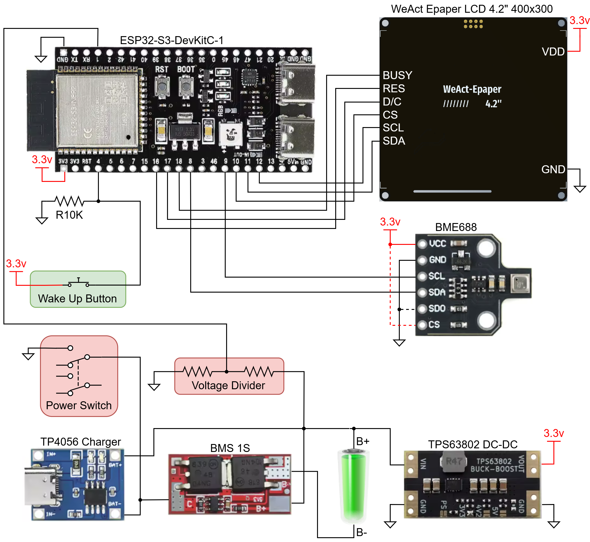

# HA Display Prototype Hardware

The prototype version is based on an ESP32-S3 development board running ESPHome with the ESP-IDF framework.

---

## Contents

- [Bill of Materials](#bill-of-materials)
- [Pin Assignment](#pin-assignment)
- [Wiring Diagram](#wiring-diagram)
- [Prototype Assembly](#prototype-assembly)

---

## Bill of Materials

* 1 x ESP32-S3-DevKitC-1 development board as main microcontroller.
* 1 x WeAct Studio 4.2" (400 × 300 px) three-color e-paper display.
* 1 x Bosch BME688 environmental and air quality sensor module.
* 1 x Li-Ion 18650 battery.
* 1 x Li-Ion 18650 battery holder.
* 1 x 1S battery protection circuit module.
* 1 x TP4056 USB-C Li-Ion charger module.
* 1 x TPS63802 buck-boost 3,3v converter module.
* 2 x Resistor 100KΩ-1MΩ for voltage divider to sense battery voltage. Currently used 261KΩ.
* 1 x Momentary push button for manual wake-up.
* 1 x Resistor 10KΩ for wake-up button pull down.
* 1 x SPDT or DPDT switch (minimum rated 200mA).
* 1 x Protoboard with 2.54mm spacing. Optimal dimensions: 92 x 90mm.
* 4 x Hex pillars male-female M2.5 x 5mm height.
* 4 x Hex pillars male-female M2.5 x 10mm height.
* 4 x M2.5 x 10mm screws.
* Wrapping wire for signal connections.
* Normal wire (AWG 24-28) for power connections.
* Female pinheads: 2 x 24 + 1 x 6. *Optional but highly recommended*.
* 60mm of double sided tape to stick the battery holder to the PCB.

---

## Pin Assignment

| ESP32-S3 GPIO | Function |
|---|---|
| GPIO1 | Battery voltage measurement |
| GPIO8 | I²C SDA |
| GPIO9 | I²C SCL |
| GPIO10 | LCD CS |
| GPIO11 | LCD SDI (MOSI) |
| GPIO12 | LCD SCK |
| GPIO4 | Button 1 |
| GPIO16 | LCD RST |
| GPIO17 | LCD D/C |
| GPIO18 | LCD BUSY |
| GPIO48 | DEBUG LED |

---

## Wiring diagram

---

## Prototype Assembly

The prototype is built on a **2.54mm pitch protoboard** using a combination of wrapping wire and conventional wire connections.

* **Wrapping wire** is used for signal connections between the ESP32-S3 and the different peripherals. This keeps the signal wiring compact and makes it easier to route the relatively large number of connections required by the prototype.
* **AWG 28 wire** is used for power connections.
* The **2.54mm protoboard** provides the mechanical and electrical base for the prototype and allows the different modules to be mounted and interconnected without requiring a dedicated PCB during the prototyping stage.

This approach was chosen to allow the hardware and software to be developed and tested quickly before moving to a dedicated PCB design.