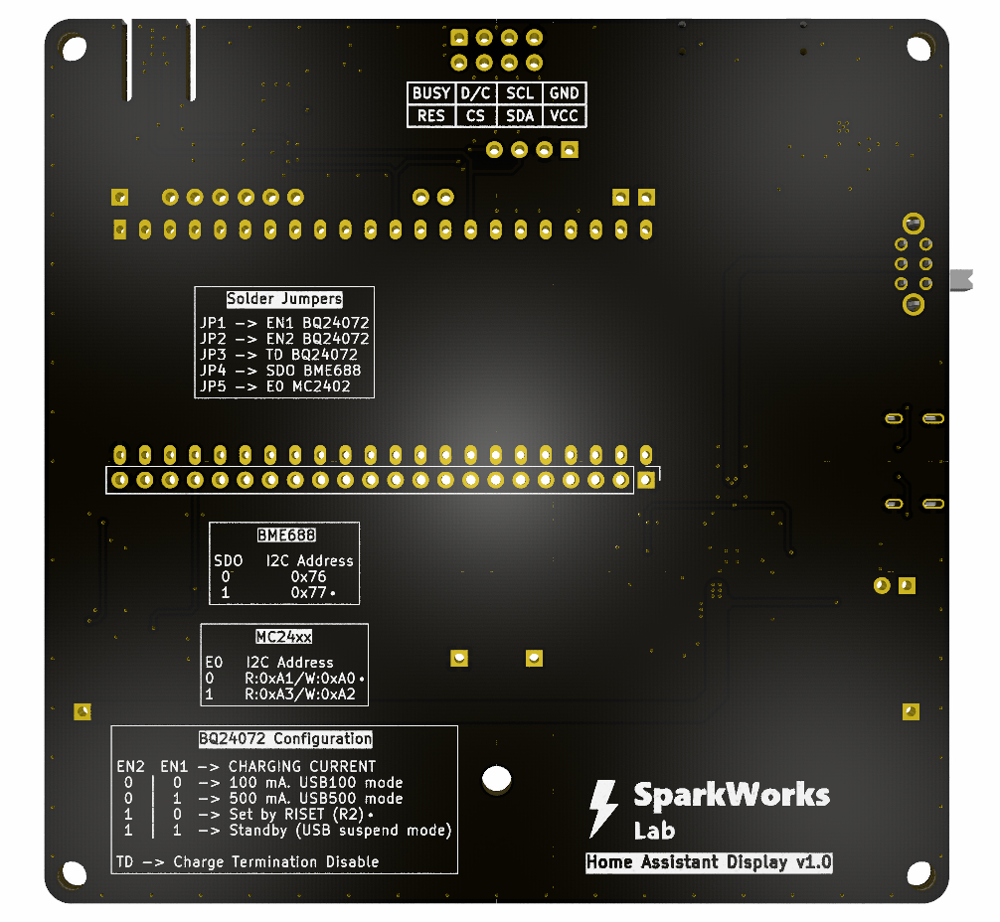

# HA Display: Hardware v1.0

The v1.0 hardware is the first dedicated PCB design for the HA Display,
replacing the prototype assembled on a 2.54mm pitch protoboard.

---

- [Overview](#overview)
- [Main Features](#main-features)
- [Hardware Specifications](#hardware-specifications)
- [Power Management](#power-management)
- [Pin Assignment](#pin-assignment)
- [PCB Configuration](#pcb-configuration)
- [Schematic](#schematic)
- [PCB Design](#pcb-design)
- [Bill of Materials](#bill-of-materials)
- [Manufacturing Files](#manufacturing-files)
- [Hardware Assembly](#hardware-assembly)
- [Version History](#version-history)

---

## Overview

The dedicated PCB integrates the main hardware required by the HA Display
into a single board, reducing wiring and simplifying assembly.

The board is designed around the ESP32-S3-DevKitC-1 and provides connections
for the e-paper display, BME688 sensor, battery, charger, wake-up button
and other peripherals.

### Top Side

### Bottom Side

---

## Main Features

* ESP32-S3-DevKitC-1 as main microcontroller.
* Dedicated connection for the 4.2" e-paper display.
* BME688 environmental and air quality sensor interface.
* 1-cell 18650 Li-Ion battery connection.
* Integrated battery voltage measurement.
* BQ24072-based USB-C battery charging and monitoring.
* TPS63001 DC-DC converter to supply 3.3v to the board.
* XB8089D Battery protection IC.
* 2 user buttons capable of wake-up the ESP32.
* Power switch.
* Charging status LEDs.
* EEPROM memory for persistent data storage.
* USB Type-C connector for power and ESP32 USB connectivity.
* Test points for debugging and measurements.
* Expansion headers for additional peripherals.
* Removable GND jumper for easy insertion of an ammeter when measuring
  board current consumption.

---

## Hardware Specifications

| Parameter | Specification |
|---|---|
| Main MCU | ESP32-S3-DevKitC-1 |
| Display | WeAct Studio 4.2" 400 × 300 px, 3-color e-paper |
| Environmental sensor | Bosch BME688 |
| Battery | 1S 18650 Li-Ion |
| Charger | BQ24072 USB-C |
| Battery protection | XB8089D |
| DC-DC converter | TPS63001 buck-boost |
| EEPROM | M24C64 |
| PCB revision | v1.0 |
| PCB stackup | 4-layer |

---

## Power Management

The board includes a dedicated power-management chain consisting of:

- **BQ24072** — Li-Ion charging and power-path management.
- **XB8089D** — battery protection.
- **TPS63001** — buck-boost conversion to 3.3 V.
- **Battery voltage divider** — provides battery-voltage monitoring to the ESP32-S3.

---

## Pin Assignment

| ESP32-S3 GPIO | Function |
|---|---|
| GPIO1 | Battery voltage measurement |
| GPIO8 | I²C SDA |
| GPIO9 | I²C SCL |
| GPIO10 | LCD CS |
| GPIO11 | LCD SDI (MOSI) |
| GPIO12 | LCD SCK |
| GPIO13 | Button 1 |
| GPIO14 | Button 2 |
| GPIO16 | LCD BUSY |
| GPIO17 | LCD RST |
| GPIO18 | LCD D/C |
| GPIO19 | USB D− |
| GPIO20 | USB D+ |
| GPIO48 | DEBUG LED |

---

## PCB Configuration

This PCB has been designed taking into consideration maximum flexibility.

### Battery Charging Current

Battery charging current can be adjusted with JP1 and JP2 jumpers.

|JP2 | JP1 | CHARGING CURRENT |
|---|---|---|
| 0  |  0  | 100 mA. USB100 mode |
| 0  |  1  | 500 mA. USB500 mode |
| 1  |  0  | Set by RISET |
| 1  |  1  | Standby (USB suspend mode) |

By default, RISET is used to set charging current to 890mA: 

$$
R_{\text{ISET}} \, (R_2) = \frac{890 \text{ A}\Omega}{890 \text{ mA}} = 1 \text{ k}\Omega
$$

Current limit is set to 1.3A using RILIM:

$$
R_{\text{ILIM}} \, (R_1) = \frac{1550 \text{ A}\Omega}{1.3 \text{ A}} = 1.2 \text{ k}\Omega
$$

### Charge Termination

The BQ24072 contain a TD input that allows termination to be enabled/ disabled. Connect TD to a logic high to disable charge termination. When termination is disabled, the device goes through the pre-charge, fast-charge and CV phases, then remains in the CV phase. During the CV phase, the charger maintains the output voltage at BAT equal to VBAT(REG), and charging current does not terminate.

This pin can be adjusted using JP3, by default is driven LOW to enable Charge Termination. If Charge Termination needs to be disabled, it can be driven HIGH easily.

### BME68x I²C Address

The BME68x I²C address can be selected using the `J4` solder jumper:

* `0x77` — default configuration.
* `0x76` — when `J4` is soldered to GND.

### MC24xx I²C Address

The MC24xx I²C address can be selected using the `J5` solder jumper:

* `R:0xA1/W:0xA0` — default configuration.
* `R:0xA3/W:0xA2` — when `J5` is soldered to 3.3v.

### Test Points

Three Test Points are provided in the Bottom Layer to enable debugging.

| TP | Function |
|---|---|
| TP1 | Ground Connection |
| TP2 | Battery Voltage measurement (Vbatt/2) |
| TP3 | 3.3v Supply Voltage |

### Current Measurement

Current consumption can be measured removing R10 (0Ω) and using J7 to connect an ammeter to the groung return of the circuit. Note that `+` sign is marked on the PCB to ensure right polarity.

This can be very useful to estimate battery life according to the selected refresh interval.

---

## Schematic

The complete schematic is available in both PDF and KiCad formats.

[View the schematic](schematic/HA-Display_v1.0.pdf).

---

## PCB Design

The v1.0 hardware has been developed using a **dedicated 4-layer PCB** designed specifically for the HA Display with controlled USB differential pair impedances and optimized power and ground planes.

The PCB was designed using KiCad. The editable KiCad project files are provided in the `kicad/` directory.

---

## Bill of Materials

The complete Bill of Materials is available in:

* [BOM](manufacturing/HA-Display_v1.0_BOM.csv).

---

## Manufacturing Files

The Gerber and drill files required to manufacture the PCB are available in:

* [Gerber files](manufacturing/HA-Display_v1.0_Gerbers.zip).
* [BOM](manufacturing/HA-Display_v1.0_BOM.csv).
* [Centroid file](manufacturing/HA-Display_v1.0-all-pos.csv).

---

## Hardware Assembly

Refer to Hardware Assembly Guide in the [manufacturing](manufacturing/README.md) folder.

---

## Version History

| Version | Description |
|---|---|
| v1.0 | First dedicated PCB design |

